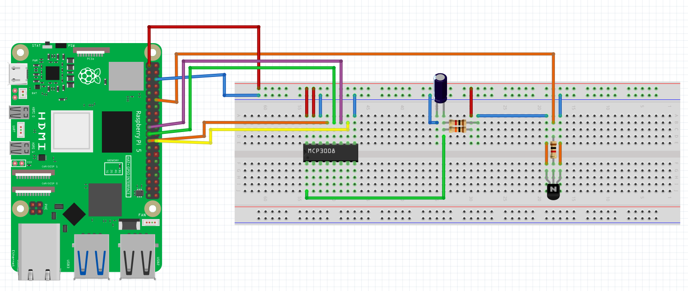
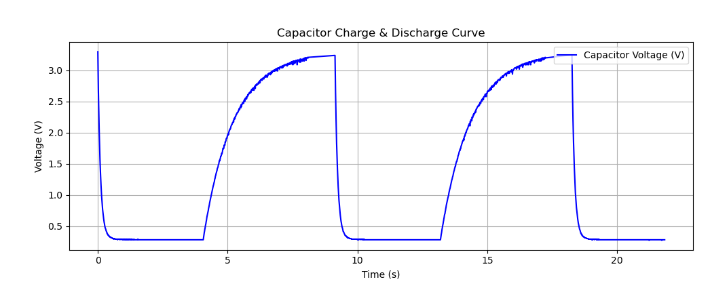

# ⚡ Capacitor Charge & Discharge Curve Visualization with Raspberry Pi

A Raspberry Pi-powered system that charges and discharges a capacitor using GPIO-controlled circuitry and plots its voltage over time. This project demonstrates RC time constant behavior using live analog data read via the MCP3008 ADC and plotted using Python.

---

## 📌 Overview

This mini project was created as part of my hands-on exploration of electronics fundamentals, particularly how capacitors behave during charge and discharge cycles. Using a transistor controlled by a GPIO pin and an MCP3008 ADC, the system logs real-time voltage across a capacitor and visualizes the classic exponential curves.

---

## 🚀 Project Objectives

- ✅ Charge a capacitor through a resistor until it reaches the supply voltage  
- ✅ Discharge the capacitor rapidly via a GPIO-controlled transistor  
- ✅ Continuously log voltage values via MCP3008 (SPI ADC)  
- ✅ Plot the capacitor voltage vs. time using Matplotlib  
- ✅ Demonstrate exponential RC charge and discharge behavior  
- 📊 Store schematic and visual plot images for future reference  

---

## 📸 Hardware Used

| Component                     | Description                                  |
|----------------------------   |--------------------------------------------- |
| Raspberry Pi (3/4/5)          | Controls GPIO and reads analog values via SPI|
| MCP3008 ADC                   | Converts analog capacitor voltage to digital |
| 1000µF Capacitor              | Stores and discharges energy                 |
| NPN Transistor (e.g., 2N2222) | Enables GPIO-controlled discharge            |
| Resistors (1kΩ, 10kΩ)         | Controls base current and charge rate        |
| Breadboard & Wires            | For prototyping the circuit                  |


---

---
## Final Schematic


  
## Capacitor Visual Plot

---

## 🧠 Technologies Used

- Python 3  
- [`gpiozero`](https://gpiozero.readthedocs.io/) for GPIO control  
- [`spidev`](https://pypi.org/project/spidev/) for SPI ADC interface  
- [`matplotlib`](https://matplotlib.org/) for data visualization  
- Fritzing for schematic design  

---

## 📦 Installation (on Raspberry Pi OS)

Install dependencies using APT and pip:

```bash
sudo apt update
sudo apt install python3-pip python3-spidev python3-gpiozero -y
pip3 install matplotlib

